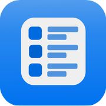
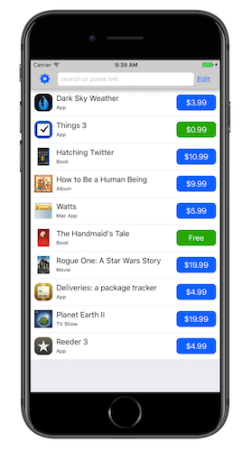
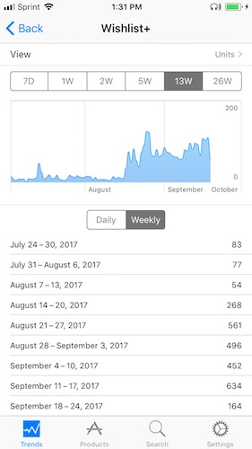

  

# Wishlist+
iOS wishlist application for iTunes and App Store items. Provides extra functionality such as a notifications for price drops.

# The Story

## Creation
I started learning Swift in January of 2017, I went through the [Hacking with Swift](https://www.hackingwithswift.com) book by Paul Hudson. Its method of teaching through examples very much spoke to me and after going through the first 12 projects I was ready to start on my own.

By March I started working on this app, an idea that I came up with on spring break in Florida. I worked on the app religiously until its completion in the first week of June.

### Challenges
* My schedule as a senior in high school in varsity sports did not give me enough time in the evening to learn Swift from scratch. I decided to get up at 5 a.m. every morning before school so that I could prioritize my effective hours.
* This was the first app that I developed start to finish on my own. 
* I had never used photoshop or done any graphical design. I used a free online tool to make the logo and mostly system icons and views in the app.

  

## App Review
This app is not currently on the App Store, it was for around 3 months and in that time it broke 3,000 downloads with no promotion outside of me tweeting the link to my friends. 

It is not on the App Store because of the App Review Guideline [3.2.2 (i)] (https://developer.apple.com/app-store/review/guidelines/#unacceptable) which says it is unacceptable to create *"an interface for displaying third party apps, extensions, or plug-ins similar to the App Store or as a general-interest collection."* I am firmly of the opinion that my app is not a *"general-interest collection"* and it appears that the App Review team waffled back and forth on the issue as well. I would be rejected by one review then accepted by the next until I tried to submit my iOS 11 update, it was taken down from the store and does not appear to be allowed back in its current form.

Sadly I do not have time to make the fundamental changes necessary to *possible* solve this issue so I am abandoning the project to focus on other things. 

  

# The Code

When I made the app I settled on some core principals:

* I would not collect data unless it was necessary 
* I would not require accounts or servers
* Make the app look as much like a system app as possible
* Use system classes 

I accomplished all of these goals using default classes and doing all of my computation on device. I was very happy with my result. 
